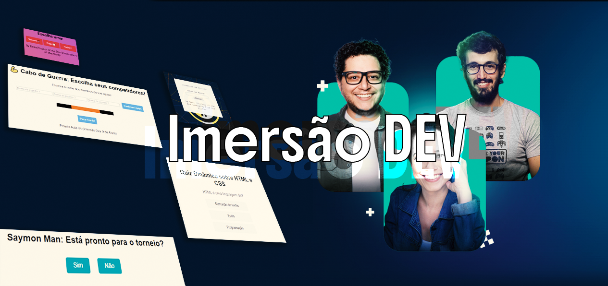

# 🚀 Imersão Dev 9 - Alura  
Projetos desenvolvidos durante a **Imersão Dev 9** da Alura, com foco em aprendizado prático de **HTML, CSS e JavaScript**.

## 📌 Sobre o Projeto  
Este repositório contém a implementação de **Minigames/projetos feitos durante as aulas**, totalmente interativos e funcionais.  

### ✨ Tecnologias Utilizadas  
- **HTML** → Estrutura dos projetos.  
- **CSS** → Estilização.  
- **JavaScript** → Lógica dos projetos e manipulação de eventos.  

## 👨‍💻 Créditos  
- **Criados por:** [BeknYTprogamador](https://github.com/BeknYTprogamador)  
- **Thumbnail por:** [SaymonS86](https://github.com/SaymonS86)  
- **Baseado nos aprendizados da Imersão Dev 9 - Alura**  
